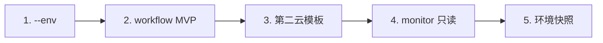

# blcli Roadmap

## 项目愿景

`blcli` 旨在成为**云平台基础设施**的一站式 CLI：用一份 `args.yaml` 和自描述模板仓，串联 **配置 → 生成 → 部署 → 观测 → 回收** 的完整生命周期。

**品牌 slogan：** 一份配置，走完云平台全链路。 / One config. Full cloud platform lifecycle.

**Slogan 拆解（产品北极星）**

| 生命周期阶段 | 用户期望 | 对应能力 |
|-------------|----------|----------|
| **一份配置** | 少文件、少重复、可校验 | `args.yaml`、`init-args`、`--profile`、`check args`、`explain` |
| **生成** | 从模板到可执行代码 | `init`、自描述模板仓、依赖排序 |
| **部署** | 可计划、可续跑、可局部执行 | `apply`、`--dry-run`、`--project`、Resume |
| **观测** | 知道当前跑得怎样 | `status`、`runs`、（v3）`monitor` |
| **回收 / 修复** | 失败能自救、能回滚 | `rollback`、`destroy`、`diagnose`、失败 hints |
| **自动化** | CI 与 Agent 能接得上 | GitHub Action、`contract`、（v3）`workflow` |
| **云平台** | 不只一家云、不只 GCP | GCP-first today；（v3）第二云模板 |

---

## 版本策略（2026-06 修订）

> **编号调整：** 原规划中的 v1.5 升格为 **v2.0**（已实现）；原 v2.0 → **v3.0**；原 v3.0 → **v4.0**；原 v4.0 → **v5.0**。

| 版本 | 定位 | 状态 |
|------|------|------|
| **v1.0** | GCP-first Phase 1 核心闭环 + Resume + 失败指引 | ✅ 已合入 main |
| **v2.0** | 更好上手 + 更好给 Agent/CI 用（原 v1.5） | ✅ 已合入 main（PR #4） |
| **v3.0** | 全链路自动化与多环境/多云扩展（原 v2.0） | 📋 规划中 |
| **v4.0** | 平台化：服务端 + Web UI（原 v3.0） | 🔮 远期 |
| **v5.0** | 智能运维与深度自动化（原 v4.0） | 🔮 远期 |

详见 `docs/zh/FEATURE_STATUS.md`。

---

## 当前状态（main）

### v1.0 + v2.0 已交付 ✅

- **核心命令**：init / init-args / apply / status / rollback / check / destroy / explain
- **可靠性**：Resume（module 级）、`PrintFailureHints` + `agent.DiagnoseFailure`
- **v2.0 增强**：`--profile` / `--wizard` / `--preview`、`check args`、`contract` / `diagnose` / `runs`、GitHub Action、`CHANGELOG`
- **模板**：GCP 官方 `bl-template` + 个人版 `bl-template-personal`

### 待收尾（发布流程，非功能）

- [ ] 对外打 **v1.0.0**、**v2.0.0** Git tag 与 GitHub Release
- [ ] `bl-template` CI workflow / README 单独合入
- [ ] `Roadmap` / `V1.0_STATUS_ANALYSIS` 与 main 完全对齐（本文档已修订）

---

## v1.0 回顾（已完成）

Phase 1：一份配置驱动 GCP 全链路命令闭环。

- [x] init / apply（terraform · kubernetes · gitops · all）/ status / rollback / destroy / check / explain
- [x] 依赖排序、执行计划、`--dry-run`、三模块 `--project`
- [x] `status --format=table|json|yaml`
- [x] 进度持久化与 Resume（`init`、`apply all`；`--no-resume` 跳过）
- [x] init 前 args 校验（`validator.Run`）
- [x] 模板：GitHub/本地、缓存、单仓库约定

**v1 明确不做：** 并行 init、自动 Git 提交、失败自动重试、多模板源合并、apply 失败自动 rollback。

---

## v2.0 回顾（已完成，原 v1.5）

围绕 slogan 的「更好配置、更好自动化接入」。

- [x] `init-args --profile`（模板 overlay）
- [x] `init-args --wizard`、`--preview`；`init --preview`
- [x] `blcli check args`
- [x] `contract` / `diagnose` / `runs` + failure fixtures
- [x] GitHub composite action + `docs/zh/CI.md`
- [x] Agent 整合失败 hints、progress step log

**v2 明确不做 / 降级：**

- `blcli bootstrap` 全 session → 弱需求，与 wizard 重叠，**暂不实现**
- Resume 细粒度（terraform project 级）→ **不做**
- 完整 `init --wizard` 逐步引导 → 已有轻量 `init-args --wizard`，**够用**

---

## v3.0 路线图（原 v2.0）

v3 目标：**在一份配置之上，覆盖多环境、可编排的全链路，并迈出「云平台」第二步（第二云）。**

### 优先级总览

| 优先级 | 含义 | 项 |
|--------|------|-----|
| **P0 强需求** | 直接支撑 slogan「一份配置 · 全链路 · 云平台」 | 见下表 |
| **P1 重要** | 显著提升体验，但可用脚本/现有命令凑合 | 见下表 |
| **P2 弱需求** | 生态/锦上添花，可延后或不做 | 见下表 |

### P0 — 强需求（v3.0 核心）

| # | 能力 | 为什么强（slogan 对齐） | 交付形态（建议） |
|---|------|------------------------|------------------|
| 1 | **环境抽象 `--env`** | 「一份配置」管 dev/stg/prd，是全链路多环境的基础 | args 模型 + 全局 `--env`；init/apply/status/rollback 过滤 |
| 2 | **`blcli workflow`** | 把 init-args → init → apply → check 串成**可声明的全链路**，是 slogan 的自动化表达 | YAML 工作流 + dry-run；复用 progress/runs/contract |
| 3 | **第二云官方模板** | slogan 是「云平台」不是「GCP 工具」；需至少一条非 GCP 完整路径 | 引擎最小抽象 + AWS 或 Azure 模板仓 MVP |
| 4 | **观测增强** | 「走完」包含知道跑得怎样；`status` 是一次性的 | `monitor` 只读 MVP：周期性 status + 可选成本/健康汇总 |
| 5 | **环境状态快照** | 与 Resume 互补：跨会话知道「这个环境装到哪了」 | 环境级状态文件，与 `runs` 关联 |

### P1 — 重要（v3.x 迭代）

| # | 能力 | 说明 |
|---|------|------|
| 6 | **workflow 模板库** | 常用流水线（bootstrap、升级、销毁）可复用 |
| 7 | **环境 diff / promote** | 对比两环境 args 或生成物差异；晋升 stg→prd |
| 8 | **CI 扩展** | GitLab CI 样板；webhook 触发 workflow |
| 9 | **依赖版本锁定** | 模板 `@tag` + lock 文件，满足可重复构建 |
| 10 | **diagnose 规则库扩展** | 更多云厂商/常见错误场景 |
| 11 | **完整 `init --wizard`** | 若用户反馈 `init-args --wizard` 不够，再补 init 侧引导 |

### P2 — 弱需求（v3 不阻塞，可进 v4+）

| # | 能力 | 说明 |
|---|------|------|
| — | `blcli bootstrap` 持久 session | 与 wizard + workflow 重叠 |
| — | 操作时间估算 | 锦上添花 |
| — | 依赖图可视化 | _power user_；explain + 文档可先代替 |
| — | 配置模板市场 / 模板市场 | 生态项；双模板仓已够用 |
| — | Jenkins 插件 | GitHub Actions 已覆盖主路径 |
| — | 多云统一控制台（3+ 云同时管） | 第二云 MVP 后再议 |
| — | 环境级 RBAC | 偏企业平台，适合 v4 server |
| — | 插件市场 | 先有插件 SDK 再谈市场 |
| — | 失败自动重试 | 产品约定不做（workflow 可显式重试步骤） |

### v3.0 建议实施顺序

1. **`--env`** — 改动面可控，立刻改善「一份配置多环境」
2. **`workflow` MVP** — 复用 v2 的 contract/runs/progress，兑现「全链路」
3. **第二云** — 证明 slogan 中的「云平台」
4. **`monitor` 只读** — 补齐「观测」阶段
5. **环境快照** — 与 Resume、runs 形成完整状态故事

### v3.0 里程碑（草案）

- **v3.0** (2026): `--env` + `workflow` MVP + 第二云（选一）+ `monitor` 只读
- **v3.1** (2026+): 环境 diff/promote、workflow 模板、CI 扩展
- **v3.2** (2026+): 依赖锁定、diagnose 扩展、插件 SDK 探索

---

## v4.0 路线图（原 v3.0）

**平台化：** 从 CLI 到团队可协作的产品。

### P0 强需求

| 能力 | 说明 |
|------|------|
| **blcli-server** | REST/gRPC API，供 Web UI 与 CI 统一调用 |
| **Web 控制台** | 项目仪表板、配置编辑、操作历史、拓扑视图 |
| **多租户与认证** | 团队使用的基础 |

### P1 / P2

| 优先级 | 能力 |
|--------|------|
| P1 | 操作审批、变更通知、审计日志 |
| P2 | 移动端、推送通知 |

---

## v5.0 路线图（原 v4.0）

**智能运维：** 在稳定平台之上的 AI 与自动化。

| 优先级 | 能力 |
|--------|------|
| P0 | 配置/成本/安全优化建议（基于真实状态） |
| P1 | 异常检测与预警 |
| P2 | 自愈、自动扩缩容、智能调度（需强 guardrail，避免与「不自动 apply」原则冲突） |

---

## 技术债务（跨版本）

| 项 | 目标版本 | 优先级 |
|----|----------|--------|
| 测试覆盖率 >80% | v3 持续 | P1 |
| 日志/错误处理统一 | v3 | P1 |
| 文档与代码同步机制 | v2 收尾 / v3 | P0 |
| 性能（并行、缓存） | v3+ | P2 |

---

## 社区与生态（跨版本，均为 P2）

- 用户案例、最佳实践、视频教程
- 模板市场、插件市场、认证培训
- 不在 v3 核心交付范围内

---

## 里程碑一览

| 版本 | 时间 | 主题 |
|------|------|------|
| **v1.0** | 2026 | GCP-first 核心闭环 + Resume + 失败指引 |
| **v2.0** | 2026 | 向导 / 预览、Agent 工具、CI 集成 |
| **v3.0** | 2026 | 多环境、workflow、第二云、观测增强 |
| **v4.0** | 2026+ | 服务端 + Web UI + 团队协作 |
| **v5.0** | 2026+ | AI 辅助与深度自动化运维 |

---

## 反馈和贡献

- GitHub Issues：问题与建议
- GitHub Discussions：功能与设计讨论
- Pull Requests：代码贡献

---

*最后更新：2026-06-26（版本号重排：v1.5→v2.0，v2→v3；按 slogan 重梳优先级）*
